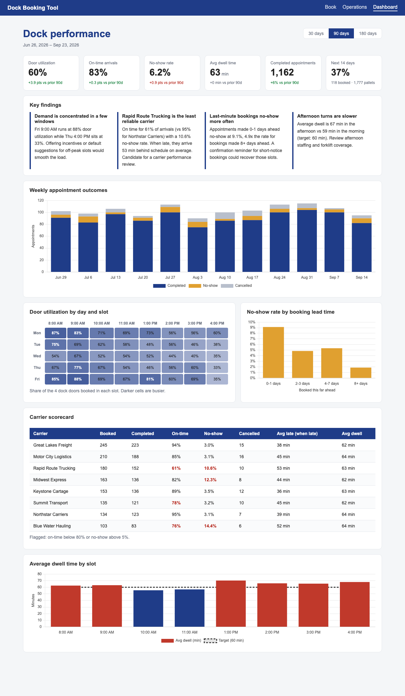
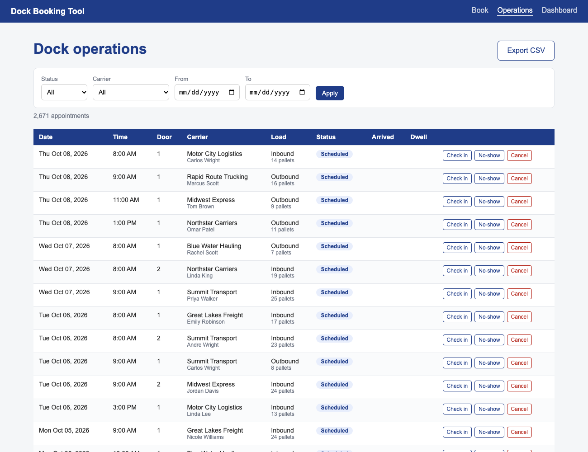
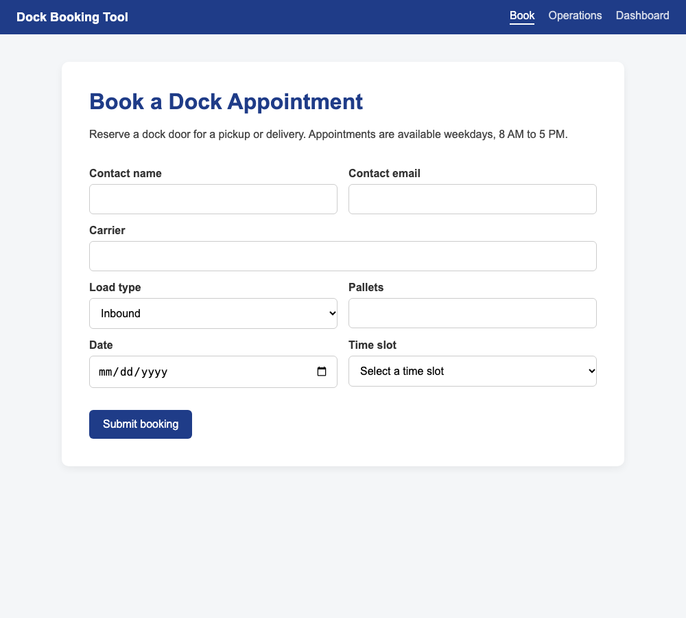

# Warehouse Dock Booking & Operations Analytics

A Flask app that schedules warehouse dock door appointments and turns the booking
data into operational insight: dock utilization, carrier reliability, no-show risk,
and turn-time bottlenecks.



## Business problem

A warehouse with 4 dock doors and 8 appointment slots per weekday was scheduling
carrier pickups and deliveries informally. That led to double-booked doors, trucks
waiting in the yard, and no visibility into which carriers were causing problems.

The operations manager needed answers to:

1. Are we using dock capacity well, and where are the peaks and gaps?
2. Which carriers arrive late or don't show up?
3. What drives slow turn times at the door?
4. Can booking policy reduce wasted slots?

## What the tool does

| Area | Features |
| --- | --- |
| **Booking** | Weekday-only scheduling, live door availability per slot, automatic door assignment, double-booking prevention, input validation |
| **Operations** | Check-in / check-out timestamps, no-show and cancel actions, filters by status, carrier, and date, pagination, CSV export |
| **Analytics** | KPI tiles with change vs the prior period, weekly outcome trend, utilization heatmap, carrier scorecard with flags, lead-time and dwell analysis, findings generated from the data |

## KPI definitions

| KPI | Definition |
| --- | --- |
| Door utilization | Non-cancelled appointments ÷ (business days × 8 slots × 4 doors) |
| On-time rate | Completed arrivals no more than 15 min after the slot start |
| No-show rate | No-shows ÷ (completed + no-shows) |
| Cancellation rate | Cancelled ÷ all appointments |
| Dwell time | Minutes from truck arrival to departure (target: 60) |
| Lead time | Days between booking creation and the appointment date |

All KPIs are calculated in SQL ([analytics.py](analytics.py)). The same business rules
live in one place ([config.py](config.py)) and are shared by the app, the analytics, and
the data generator.

## Key findings (90-day window, synthetic data)

- **Demand is lopsided.** Monday and Friday mornings run at 85–88% door utilization
  while late afternoons sit near 35%. Steering flexible loads to off-peak slots
  would reduce yard congestion without adding doors.
- **Two carriers drive most reliability problems.** Rapid Route Trucking (61% on time,
  10.6% no-show) and Blue Water Hauling (76% on time, 14.4% no-show) fall well below
  the 94–95% on-time rate of the best carriers. Both are candidates for a
  performance review or scorecard-based slot priority.
- **Short-notice bookings are the no-show risk.** Appointments made 0–1 days ahead
  no-show at 9.1%, nearly 5× the rate for bookings made 8+ days ahead. A
  confirmation reminder for same-day and next-day bookings is a low-cost fix.
- **Turn times miss target when slots are full and in the afternoon.** Afternoon
  appointments in a full slot average ~78 min vs ~54 min for morning appointments
  with open doors. Afternoon staffing and forklift coverage are the levers.
- **Month-end needs extra capacity.** The last 3 business days of each month average
  22.9 appointments per day vs 18.1 the rest of the month (+27%). That's the window
  to schedule extra dock staff.

## SQL analysis

[sql/analysis_queries.sql](sql/analysis_queries.sql) contains seven standalone queries,
each written to answer one business question. They use CTEs, window functions
(`RANK`, `LAG`), recursive date generation, and conditional aggregation.

```bash
sqlite3 -header -column instance/bookings.db < sql/analysis_queries.sql
```

## About the data

[seed_data.py](seed_data.py) generates about 2,700 appointments: 6 months of history plus
2 weeks of upcoming bookings. The generator is seeded, so the results are reproducible.
It builds in business patterns so the analysis has something real to find:

- Carriers with different on-time rates, no-show rates, and lateness
- Monday and Friday peaks, busy mornings, and a surge in the last 3 business days of each month
- About 15% volume growth over the period
- Higher no-show risk for bookings made 0–1 days ahead
- Dwell time driven by pallet count, load type, full slots, and afternoon staffing

## Run it locally

```bash
python -m venv venv
source venv/bin/activate
pip install -r requirements.txt
python seed_data.py        # builds instance/bookings.db with sample data
flask --app app run --port 5001
```

Then open http://localhost:5001. The dashboard is at `/dashboard`.

## Screenshots

| Operations | Booking |
| --- | --- |
|  |  |

## Tech stack

Python · Flask · SQLAlchemy · SQLite · SQL · Chart.js · HTML/CSS

## Project structure

```
app.py                  Routes: booking, availability API, operations, export, dashboard
analytics.py            KPI and analysis queries behind the dashboard
config.py               Business rules (slots, doors, on-time grace, dwell target)
models.py               Booking data model
seed_data.py            Synthetic data generator with business patterns
sql/analysis_queries.sql  Standalone SQL analysis
templates/, static/     UI
```
